# ERP Setup Assistant

A decision-support system for an ERP functional consultant. It knows the setup options
of the client's ERP software and add-ons, argues which options fit a specific client
and why, learns from every past decision, and runs on any LLM platform that can read
files — Claude today, Microsoft Copilot Studio as a second deployment target.

**The repository is the system.** All knowledge, client records and expertise are plain
markdown under git: no infrastructure, no running cost, fully auditable, portable.

## What it does

Ask it, on any client engagement:

> "Client X runs Business Central with Aptean lot management and catch weight. We're
> designing the warehouse. What are my options and what do you recommend?"

and it will:

1. **Check for relevant software updates first** (at most once a day per stack — see
   `system/update-check-log.md`), then enumerate **every setup option** valid for that
   exact stack (standard ERP knowledge + add-on overlays that change or extend it).
2. **Argue each option** for/against based on the client's intake facts — and tell you
   which client facts are still missing.
3. Check the **expertise layer** — past decisions (SDRs) and lessons learned (LLs) —
   and cite them where they support or contradict an option.
4. Give a recommendation with confidence level, flagging irreversible choices.
5. **Record** the confirmed decision as a new SDR, closing the learning loop.

And on top of the advisory loop it produces the **client deliverable**:

> "Here are the transcripts and notes of the requirement workshops. Build the BPA."

The BPA system turns meeting material into a **Business Process Analysis**: an
interactive HTML file with clickable BPMN process diagrams where every step opens the
documentation of that business scenario — standard Business Central, add-on (Aptean,
Continia, …), workaround, or GAP. Built on the Cegeka Process Model template and
grounded in the evidence-based **Business Process Catalog**
([`bpa/catalog/`](bpa/catalog/), refreshed monthly), filtered to what is relevant for
the client, in the client's language (NL/EN built in, more addable) with official BC
terminology, in the **Cegeka corporate identity** with one-click **PDF export**
(full document or chosen domains, branded cover page). See [`docs/bpa.md`](docs/bpa.md)
and the worked demo in [`clients/_demo-bakkerij-florax/`](clients/_demo-bakkerij-florax/).

**And the BPA feeds the whole delivery pipeline** — each stage with templates, docs,
demo artifacts and mechanical quality gates (`tools/check_client.py`). **Between every
step sits a human gate** ([`docs/gates.md`](docs/gates.md)): the assistant stops, the
consultant steers the output with directives (in the gate block or simply in chat),
and only their explicit approval opens the next step — no approval with open
directives, machine-enforced:

| Stage | What it produces | Guide |
|---|---|---|
| Setup plan | ordered BC configuration workbook from the BPA scope | [`docs/setup.md`](docs/setup.md) |
| FGD → *human review* → TGD | functional & technical gap designs, buildable by an external developer | [`docs/gap-designs.md`](docs/gap-designs.md) |
| Migration | client-run after RapidStart training: entity workbooks + consultant checkpoints | [`docs/migration.md`](docs/migration.md) |
| Test / UAT | key-user acceptance scripts generated from the BPA + FGD criteria; sign-off gate | [`docs/testing.md`](docs/testing.md) |
| Training | trajectory + per-session prep (environment, demo script, exercises) | [`docs/training.md`](docs/training.md) |
| User manual | interactive handbook; ungrounded sections auto-flagged for consultant review | [`docs/manual.md`](docs/manual.md) |
| Aftercare | issue + change-request registers that feed the flywheel; productisation path | [`docs/aftercare.md`](docs/aftercare.md) |

Quality on any Claude model (Fable/Opus/Sonnet) comes from the same mechanism:
explicit pipelines + templates + validators — see
[`system/model-guide.md`](system/model-guide.md) (also covers cost practices) and
[`docs/operations.md`](docs/operations.md) for running this inside a live project.

## The methodology and its assets — at a glance

The project methodology has six phases; every asset in this repo serves one or
more of them. The per-phase guides in [`methodology/`](methodology/) explain each
asset in plain language — this map shows where everything is used:

```mermaid
flowchart TB
    subgraph P1["1 · Prepare"]
        A11["clients/_template/<br/>blank client workspace + intake interview"]
        A12["clients/_template/bpa/briefings/ · bpa/packs/<br/>workshop briefing format · industry content packs"]
    end
    subgraph P2["2 · BPA (analysis)"]
        A21["bpa/catalog/ + tools/catalog.py + /catalog-refresh<br/>evidence-based Business Process Catalog<br/>(template numbering = master, tied to the cost model)"]
        A22["bpa/template/ · bpa/processes/ · bpa/terminology/<br/>Cegeka Process Model text + BS/BC codes ·<br/>standard BPMN flows (NL/EN) · official BC terms"]
        A23["bpa/viewer/ + bpa/branding/ + tools/build_bpa.py<br/>interactive BPA deliverable · Cegeka identity · PDF export"]
        A24["pricing/ + tools/build_quote.py<br/>effort baselines → quote annex from coverage"]
    end
    subgraph P3["3 · SDB (Solution Design & Build)"]
        A31["clients/_template/setup/ (+ system/stack-versions.md)<br/>setup plan · environments · verification probes"]
        A32["clients/_template/gaps/<br/>FGD → human review → TGD → AL scaffold"]
        A33["clients/_template/migration/<br/>entity workbooks · RapidStart training · checkpoints CP1–CP3"]
    end
    subgraph P4["4 · Test"]
        A41["clients/_template/test/<br/>test plan · scripts from BPA + FGD criteria ·<br/>defect register · per-domain sign-off gate"]
    end
    subgraph P5["5 · Deploy"]
        A51["clients/_template/training/<br/>trajectory · session preps · learning packets"]
        A52["clients/_template/manual/ + tools/build_manual.py<br/>interactive user manual (grounded topics, PDF export)"]
    end
    subgraph P6["6 · Support"]
        A61["clients/_template/aftercare/<br/>issue + CR registers · wave reports"]
        A62["/wave-impact · /harvest · tools/metrics.py<br/>release-wave impact · knowledge harvest · telemetry"]
    end
    subgraph CC["Used in every phase"]
        C1["methodology/<br/>phase guides + glossary — start here"]
        C2["system/instructions.md<br/>assistant behaviour<br/>(CLAUDE.md · copilot-studio/)"]
        C3["knowledge/ · expertise/ · clients/*/decisions/<br/>capabilities · lessons learned · SDRs"]
        C4["tools/check_client.py · tools/doctor.py<br/>quality gate after every step · clone health"]
        C5["/review-system + system/reviews/<br/>human review of any component"]
        C6["clients/_demo-bakkerij-florax/<br/>worked example of every phase"]
    end

    P1 --> P2 --> P3 --> P4 --> P5 --> P6
    P6 -.-> LOOP(["↻ learning loop — lessons · SDR outcomes · catalog evidence ·<br/>calibrated baselines feed phase 1 of the next project"])
```

Two rules hold the map together: deliverable numbering follows the **Cegeka
template's BS/BC scenario codes** everywhere (the cost model in `pricing/` keys
on them — new codes only enter via reviewed catalog candidates), and **nothing
ships ungated** — a human gate with directives between every pipeline step
([`docs/gates.md`](docs/gates.md)), `check_client.py` after every authoring
step, a human `/review-system` verdict on designs and template changes.

## Repository map

| Path | What lives there |
|---|---|
| [`methodology/`](methodology/) | **Start here if you're new** — six phase guides (Prepare → BPA → SDB → Test → Deploy → Support) mapping every asset, tool and expertise entry point per phase, plus the jargon glossary |
| [`system/instructions.md`](system/instructions.md) | The assistant's behaviour — single source of truth |
| [`system/update-check-log.md`](system/update-check-log.md) | Throttle log for the once-a-day software-freshness check |
| [`CLAUDE.md`](CLAUDE.md) | Activates the assistant in any Claude session on this repo |
| [`knowledge/erp/business-central/`](knowledge/erp/business-central/) | Standard BC setup decisions per functional area |
| [`knowledge/addons/aptean-food-beverage/`](knowledge/addons/aptean-food-beverage/) | How Aptean F&B changes/extends those decisions |
| [`knowledge/_templates/`](knowledge/_templates/) | Templates to add any other ERP system or add-on |
| [`clients/`](clients/) | One folder per client: intake + Setup Decision Records + BPA workspace |
| [`bpa/`](bpa/) | BPA system: Cegeka Process Model template + scenario catalog, **Business Process Catalog** ([`bpa/catalog/`](bpa/catalog/), evidence-based, monthly refresh), Cegeka branding ([`bpa/branding/`](bpa/branding/)), standard BPMN flows (bilingual), terminology glossary, interactive viewer with PDF export |
| [`tools/`](tools/) | `build_bpa.py` · `build_manual.py` · `build_quote.py` · `catalog.py` (Business Process Catalog) · `check_client.py` (quality gates) · `metrics.py` (telemetry) · `doctor.py` (clone health check) · `split_bpa_template.py` |
| [`bpa/packs/`](bpa/packs/) · [`pricing/`](pricing/) | Industry content packs · effort baselines for quoting — **keyed to the template's BS/BC codes** (numbering never changes; new codes only via reviewed catalog candidates) |
| [`CHANGELOG.md`](CHANGELOG.md) | Version history (v1 foundation, v2 branding/PDF/catalog/methodology) |
| [`.claude/skills/`](.claude/skills/) | `dynamic-report` · `harvest` · `wave-impact` · `catalog-refresh` (monthly catalog verification) · `review-system` (human review of any component, tracked in [`system/reviews/`](system/reviews/)) |
| [`expertise/`](expertise/) | Lessons learned across clients — consulted before every recommendation |
| [`copilot-studio/`](copilot-studio/) | Instructions + step-by-step guide to run this in Copilot Studio |
| [`docs/`](docs/) | [Maintenance routine](docs/maintenance.md) · [Adding ERPs/add-ons](docs/adding-an-erp-or-addon.md) |

## Using it

- **In Claude** (Code, desktop, or web with this repo attached): just start asking.
  `CLAUDE.md` loads the role automatically. The assistant reads and *writes* files —
  intakes, SDRs, lessons — directly.
- **New to the methodology?** Ask *"I'm in phase X for client Y — where are we and
  what's next?"* — the assistant reads the [`methodology/`](methodology/) guide for
  that phase, inspects the client's workspace and the checker output, and walks you
  through the next step. No prior knowledge of this repo needed.
- **In Copilot Studio / Teams:** follow [`copilot-studio/DEPLOYMENT.md`](copilot-studio/DEPLOYMENT.md)
  (~30 min one-time). Decision records come back as copy-paste blocks there.
- **New client:** copy `clients/_template/` → `clients/<client-slug>/`, then let the
  assistant interview you to fill the intake.
- **Cloning to another GitHub account / new instance:** run `python3 tools/doctor.py`
  then follow [`docs/cloning.md`](docs/cloning.md). The system is plain files under
  git — a clone needs only Python 3.8+ to be fully usable.

## Keeping it alive

Four routines, all assistant-driven: record each confirmed decision (~5 min), review
outcomes at project milestones (~15 min via `/harvest`), refresh knowledge after
software releases (2–3×/year), and the **monthly catalog refresh** (`/catalog-refresh`
— the first session each month that touches BPA work offers it automatically).
Details in [`docs/maintenance.md`](docs/maintenance.md).

⚠️ This repo will contain client-related information — keep it private and put only
what setup decisions need into intakes.
