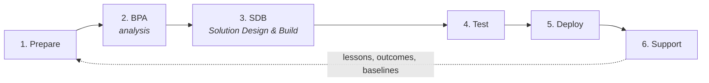

# The methodology — start here

You are looking at a complete ERP implementation methodology that runs as a set
of plain files plus an AI assistant. If you have **never seen this system
before**, this folder is your entry point: one guide per phase explains, in
plain language, what the phase is for, what you produce, which assets and tools
you use, and how past experience (the "expertise layer") flows into your work.

**The one-paragraph version:** we implement Microsoft Dynamics 365 Business
Central (an ERP system) at clients. The project moves through six phases. In
every phase, the repository gives you three things: **templates** (so you never
start from a blank page), **an assistant workflow** (the AI does the mechanical
work and argues options against evidence from past projects), and **mechanical
quality gates** (scripts that tell you when the phase is actually done). Every
decision and outcome is recorded, so each project makes the next one smarter.

## The six phases



| # | Phase | In plain words | Guide | Client workspace folders |
|---|---|---|---|---|
| 1 | **Prepare** | get to know the client, set up their file, prepare the workshops | [`01-prepare.md`](01-prepare.md) | `intake.md` · `bpa/briefings/` |
| 2 | **BPA** | turn workshop material into the analysis document the client signs | [`02-bpa.md`](02-bpa.md) | `bpa/` · `decisions/` · `commercial/` |
| 3 | **SDB** | design and build the solution: configure BC, design/build customisations, prepare data migration | [`03-sdb.md`](03-sdb.md) | `setup/` · `gaps/` · `migration/` |
| 4 | **Test** | key users prove the system works for their processes | [`04-test.md`](04-test.md) | `test/` |
| 5 | **Deploy** | train the users, hand over the manual, go live | [`05-deploy.md`](05-deploy.md) | `training/` · `manual/` |
| 6 | **Support** | aftercare: issues, change requests, release waves — and feeding what we learned back into the system | [`06-support.md`](06-support.md) | `aftercare/` |

Every guide has the same shape: *what this phase is → entry criteria → what you
produce → how to work step by step → your assets → how expertise flows in →
definition of done → common pitfalls*.

## How to get guided

Ask the assistant, in any session on this repo:

> "I'm in the **SDB phase** for client X — where are we and what's next?"

It will read the phase guide, inspect the client's workspace (which files
exist, their statuses, what the checks say) and walk you through exactly what
is missing. You never need to memorise this folder — it's the assistant's
script as much as your reference.

Two commands you will use in every phase:

```bash
python3 tools/check_client.py clients/<slug>   # is this phase's work complete and consistent?
python3 tools/doctor.py                        # is the system itself healthy?
```

## Glossary — the jargon, once

| Term | Meaning |
|---|---|
| **BC** | Microsoft Dynamics 365 Business Central, the ERP system we implement |
| **Add-on** | licensed extension of BC (Aptean Food & Beverage, Continia, Tasklet, …) |
| **BPA** | Business Process Analysis — the analysis deliverable: the client's processes as clickable BPMN diagrams with documentation per step |
| **BPMN** | standard notation for drawing business processes (boxes, arrows, lanes) |
| **Scenario / BS-code** | one coded business process step from the Cegeka Process Model, e.g. `BS25.202 Verkooporders maken` |
| **Catalog** | `bpa/catalog/` — the evidence-based register of which scenarios are actually achievable in standard BC (see its README) |
| **Coverage** | the client's scope matrix: which scenarios are in/out of scope and why |
| **Invulling** | how a scenario is met: `standaard` (plain BC), `add-on`, `workaround`, or `gap` |
| **REQ** | a numbered client requirement extracted from workshop material |
| **GAP** | a requirement standard BC cannot meet — becomes a customisation |
| **FGD / TGD** | Functional / Technical Gap Design — the two design documents per GAP (what it must do / how a developer builds it) |
| **AL** | BC's programming language; GAP customisations ship as AL extensions |
| **SDR** | Setup Decision Record — one recorded configuration decision: options, arguments, what was chosen and why |
| **LL** | Lesson Learned — a cross-client pattern promoted from SDR outcomes (`expertise/lessons-learned.md`) |
| **UAT** | User Acceptance Test — key users run scripted tests and sign off |
| **RapidStart** | BC's data-import tooling; clients run their own migration after we train them on it |
| **CR** | Change Request — post-go-live change, delivered from an approved design |
| **Wave** | Microsoft's twice-yearly BC release; `/wave-impact` reports what it changes for a client |
| **Skill** | a slash-command workflow for the assistant (`/harvest`, `/wave-impact`, `/catalog-refresh`, `/review-system`, `/dynamic-report`) |

## Where the expertise lives (and why you should care)

Three layers make your advice better than a generic consultant's, in every phase:

1. **`knowledge/`** — what BC and the add-ons can actually do, per functional
   area, as setup decisions with options and required client info.
2. **`bpa/catalog/`** — which business scenarios are proven achievable
   (evidence per scenario: which clients, which official docs, when last
   verified).
3. **`expertise/` + `clients/*/decisions/`** — lessons learned and past
   decisions with outcomes. Search these **before recommending anything**; cite
   them (`LL-004`, `SDR-012`) when they support or contradict an option.

The phase guides tell you exactly where each layer enters your work.
